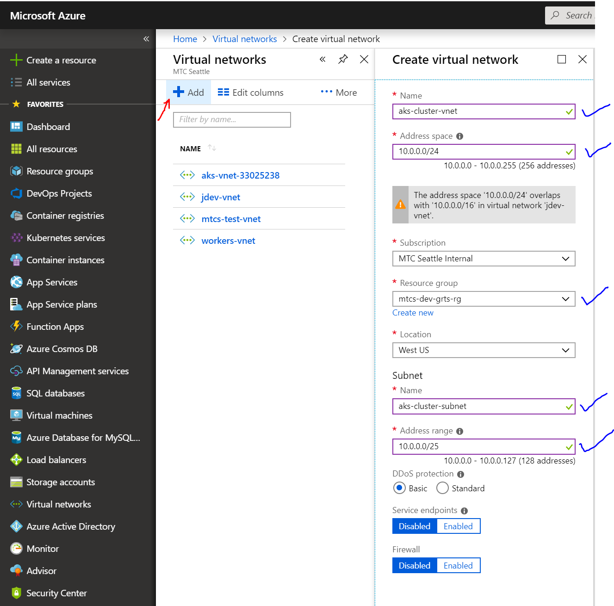
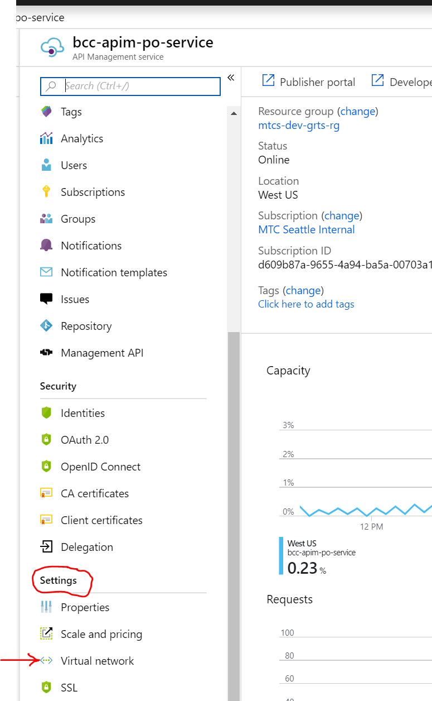
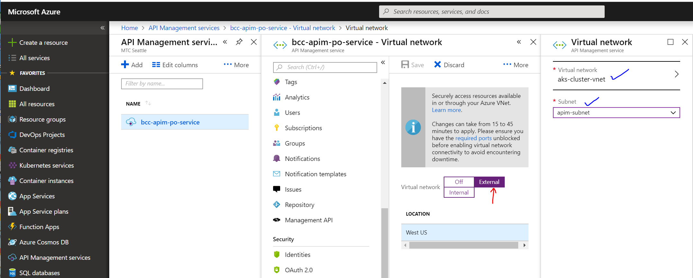
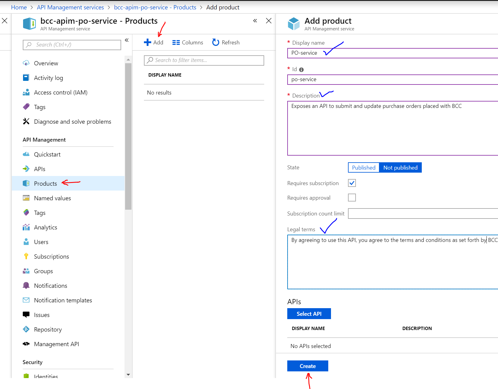
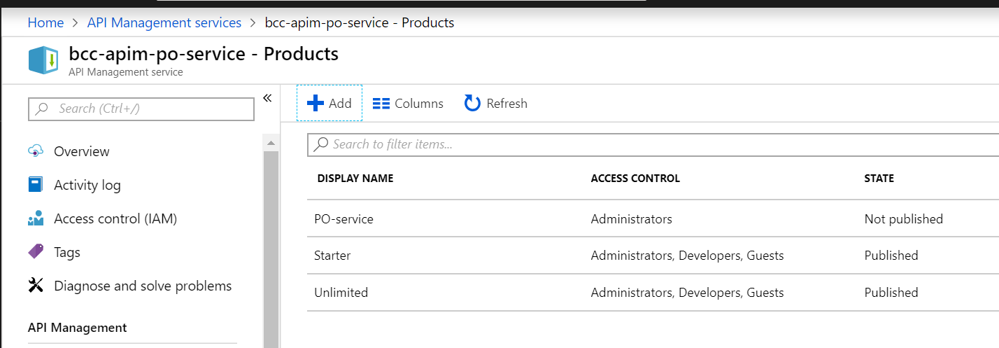

## Use Azure API Manager to manage the lifecycle of Web API's

**Prerequisites:**
1.  Before beginning to work on this project, readers are required to complete all hands-on labs (Sections) in the [parent project](https://github.com/ganrad/k8s-springboot-data-rest).  In case you have come to this project directly, go back and finish the lab exercises in the parent project.

**Description:**

In a nutshell, you will work on the following tasks.
1. Define a *Product and API's* in **Azure API Management** PaaS to expose the *po-service* API 

**Workflow:**

For easy and quick reference, readers can refer to the following on-line resources as needed.
- [Azure API Management](https://docs.microsoft.com/en-us/azure/api-management/api-management-key-concepts)

**Important Notes:**

### A] Provision a new AKS cluster and configure advanced networking (Azure CNI)
**Approx. time to complete this section: 30 Minutes**

By default, AKS clusters use *Basic* networking which creates and configures a virtual network and subnet for the cluster nodes.  For this project, we will deploy an AKS cluster with *Advanced* networking option to allow us to configure APIM Service on the same subnet as the cluster.   The advanced networking option configures Azure CNI (Container networking interface) for the AKS cluster.  The end result is that Azure networking assigns IP addresses for all cluster nodes and pods.

Login to [Azure Portal](https://portal.azure.com/).

1. Create a */24* virtual network and subnet.  See screenshot below.

   

   Click **Create**.  Check to make sure the virtual network was provisioned ok.

   

2. Get the subnet resource ID.

   The AKS cluster nodes will be deployed within the VNET and subnet created in the previous step. Login to the Linux VM (Bastion Host) for issuing all Azure CLI commands.

   ```
   # Substitute correct values for 'Resource Group' and 'VNET' name
   $ az network vnet subnet list --resource-group myResourceGroup --vnet-name aks-apim-vnet --query [].id --output tsv
   #
   ```

   Save the subnet resource ID.  We will need it in the next step.

3. Create the AKS Cluster with *Advanced networking* (Azure CNI) option

   Refer to the command snippet below to provision an AKS cluster.  Specify **azure** for the *--network-plugin* option to create an AKS cluster with advanced networking option (Azure CNI).  Also, make sure to specify the subnet resource ID value for parameter *--vnet-subnet-id*, the value which you saved in the previous step.

   ```
   # Retrieve k8s versions
   $ az aks get-versions
   #
   # Substitute correct values for 'Resource Group', 'Cluster Name' and '--vnet-subnet-id'.  Deploy ks8 v1.11.3 or specify another version.
   $ az aks create --resource-group myResourceGroup --name aks-apim-cluster --network-plugin azure --vnet-subnet-id <subnet-id> --docker-bridge-address 172.17.0.1/16 --dns-service-ip 10.2.0.10 --service-cidr 10.2.0.0/24 --node-count 1 --kubernetes-version "1.11.3" --dns-name-prefix akslab2 --location westus --disable-rbac
   #
   ```

   The AKS cluster provisioning process will take approx. 5-10 minutes to complete.  Once the AKS cluster is up, there should be 1 node deployed within the cluster.  Use the command snippet below to connect and view the status of the cluster.

   ```
   # Verify state of aks-apim-cluster
   $ az aks show -g myResourceGroup -n aks-apim-cluster --output table
     Name              Location    ResourceGroup     KubernetesVersion    ProvisioningState    Fqdn
     ----------------  ----------  ----------------  -------------------  -------------------  -------------------------------------
     aks-apim-cluster  westus      mtcs-dev-grts-rg  1.11.3               Succeeded            akslab2-a70564cc.hcp.westus.azmk8s.io
   #
   # Connect to the AKS cluster.  Substitute correct values for 'Resource Group' and 'AKS Cluster Name'
   $ az aks get-credentials --resource-group myResourceGroup --name aks-apim-cluster
   #
   # Retrieve cluster info.
   $ kubectl cluster-info
   #
   # Verify no. of nodes in cluster
   $ kubectl get nodes
     NAME                       STATUS    ROLES     AGE       VERSION
     aks-nodepool1-15652387-0   Ready     agent     10m       v1.11.3
   #
   ```

### B] Deploy an internal (Private) *Ingress Controller* and *Load Balancer*
**Approx. time to complete this section: 30 Minutes**

An internal ingress controller makes Web API's deployed on a Kubernetes cluster accessible only to applications running in the same virtual network as the cluster.  As part of the ingress controller deployment, an internal Azure Load Balancer (ALB) instance is also provisioned.  An available private IP address from the virtual network subnet is assigned to the ALB instance's frontend.  The *Backend pool* of the ALB instance is configured to point to the AKS cluster nodes.  Load balancing rules are configured to direct traffic (HTTP/HTTPS) from the frontend IP to the backend pool.

The internal ingress controller will expose ports 80 and 443 and provide a single point of entry for all web traffic destined to all services deployed within the AKS cluster.

1. Initialize *Helm* by installing *Tiller* on the AKS cluster

   Helm will be used to deploy the ingress controller.  Refer to the command snippet below to install *Tiller* on the AKS cluster and initialize the client.

   ```
   # Initialize Helm client and install 'Tiller' on AKS cluster
   $ helm init
   #
   # Verify 'Tiller' is running in the 'kube-system' namespace.  Output should list a pod ('tiller-deploy...') in 'RUNNING' state.
   $ kubectl get pods -n kube-system
   #
   ```

2. Review and then deploy the Kubernetes *Service* manifest file `./k8s-resources/internal-lb.yaml`.  Refer to the command snippet below.
  
   ```
   # Make sure you are in the 'azure-apim' directory
   $ cd ./extensions/azure-apim
   #
   # Deploy the k8s service for internal lb.
   $ kubectl apply -f ./k8s-resources/internal-lb.yaml
   #
   # List the helm releases
   $ helm list
     $ helm ls
     NAME            REVISION        UPDATED                         STATUS          CHART                   NAMESPACE
     iced-zorse      1               Tue Nov  6 16:30:16 2018        DEPLOYED        nginx-ingress-0.30.0    kube-system
   #
   $ kubectl get svc -n kube-system
     $ kubectl get svc -n kube-systemespace kube-
     NAME                                       TYPE           CLUSTER-IP   EXTERNAL-IP   PORT(S)                      AGE
     heapster                                   ClusterIP      10.2.0.142   <none>        80/TCP                       3h
     iced-zorse-nginx-ingress-controller        LoadBalancer   10.2.0.17    10.0.0.35     80:32598/TCP,443:30758/TCP   3m
     iced-zorse-nginx-ingress-default-backend   ClusterIP      10.2.0.44    <none>        80/TCP                       3m
     kube-dns                                   ClusterIP      10.2.0.10    <none>        53/UDP,53/TCP                3h
     kubernetes-dashboard                       ClusterIP      10.2.0.246   <none>        80/TCP                       3h
     metrics-server                             ClusterIP      10.2.0.48    <none>        443/TCP                      3h
     tiller-deploy                              ClusterIP      10.2.0.136   <none>        44134/TCP                    2h
   #
   ```
   Use the *Load Balancers* blade in the Azure Portal to view the properties of the internal ALB.  See screenshots below.

   

   

### C] Provision an Azure API Management (APIM) Service
**Approx. time to complete this section: 30 Minutes**

In this section, we will provision and configure an Azure API Management Service.

1. Create the APIM Service

   Click on **All Services** in the left navigational panel and search for text **API**, then select the star besides API Management Services as shown in the screenshot below.  This will add the API Management Services link to the navigational panel.

   

   Click on **API Management Services** in the left navigational panel and then click on **Create API management service** link in the detail pane (blade on the right).  See the screenshot below.

   

   In the API Management service definition web page, specify values as shown in the screenshot below.  The value for field **Name** has to be unique across all APIM services in Azure.  For field **Organization name**, provide a fictious value and select *Developer (No SLA)* for **Pricing tier**.  The Organization name will be used in the title of the **Developer Portal** (Website) exposed by Azure APIM.  For **Location** field, specify the same *Region* in which you deployed the AKS cluster in the parent project labs.

   

   Click on **Create**.  The APIM service will take a few minutes to get provisioned.

2. Connect APIM Service to the AKS Virtual Network

   The APIM service has to be deployed in the AKS virtual network (VNET), so it can access the API's exposed by the *po-service* microservice.

   Click on the APIM service and then click on **Virtual network** under **Settings** in the navigational menu on the left.  See screenshot below.

   

   Click on the **External** button.  Verify and make sure the **Location** field displays the *Region* in which the AKS cluster is deployed.  Click on the field below **VIRTUAL NETWORK** and select the VNET and **Subnet** used by the AKS cluster nodes.  Click **Apply**.  See screenshot below.

   

   Then click **Save** as shown in the screenshot below.

   
   
   It will take a few minutes for the APIM service to get updated.  

### D] Expose the Springboot Java Microservice APIs (po-service) using Azure API Management Service
**Approx. time to complete this section: 1 Hour**

1. Create and Publish an API Product
   A *Product* is used to group a set of API's offered by a department, a group (organizational unit) or a line of business within a given organization.  A Product can also be used to group API's for a specific product (or product group) manufactured and sold by a company.
   
   Click on the APIM service and then click on **Products** in the navigational menu on the left to display the **Products** page.  Then click on **Add**.  See Screenshot below.

   

   Specify a name for the API in the **Display name** field.  For **State**, leave **Not Published** selected.  API Products have to be published before they can be invoked.  Un-published products can only be invoked and viewed by members of the **Administrators** group.  Check **Require Subscription** as we want clients to subscribe to an API Product before they can start consuming it.  Leave **Requires approval** unchecked as we don't want to approve subscription requests from API consumers.  Do not click on the **Select API** link as we will create an API for the **po-service** in the next step.  Click **Create**.

   


   You have now successfully completed this lab.  Congrats!

   To recap, during this lab you completed the following steps -

