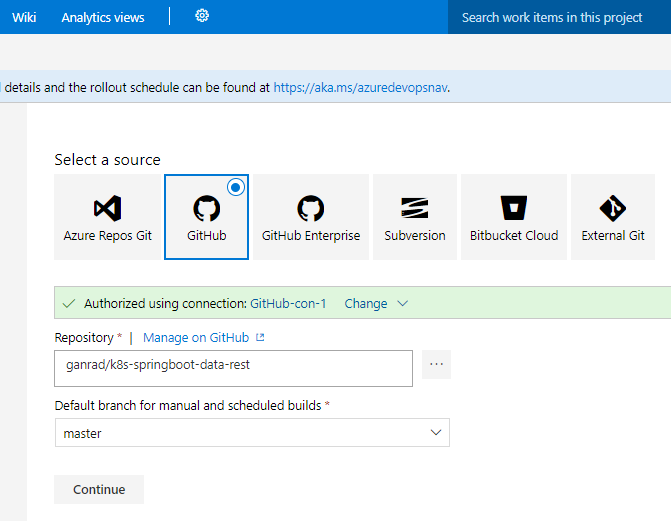
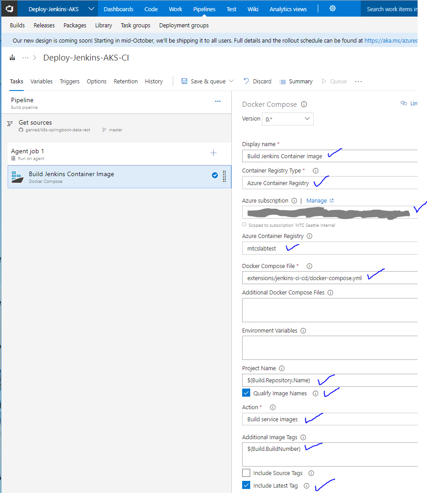
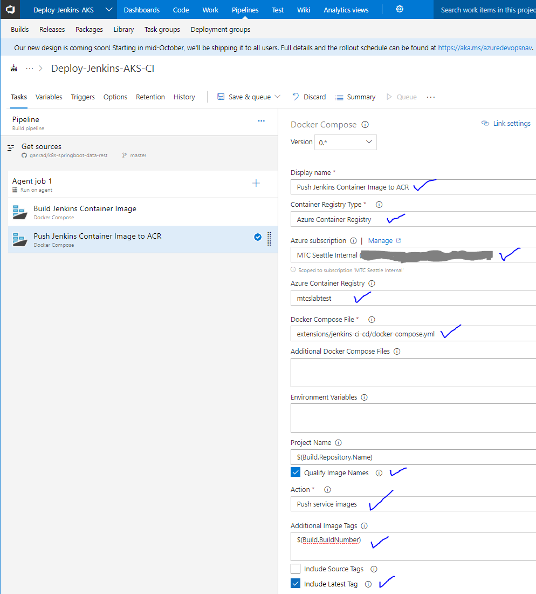
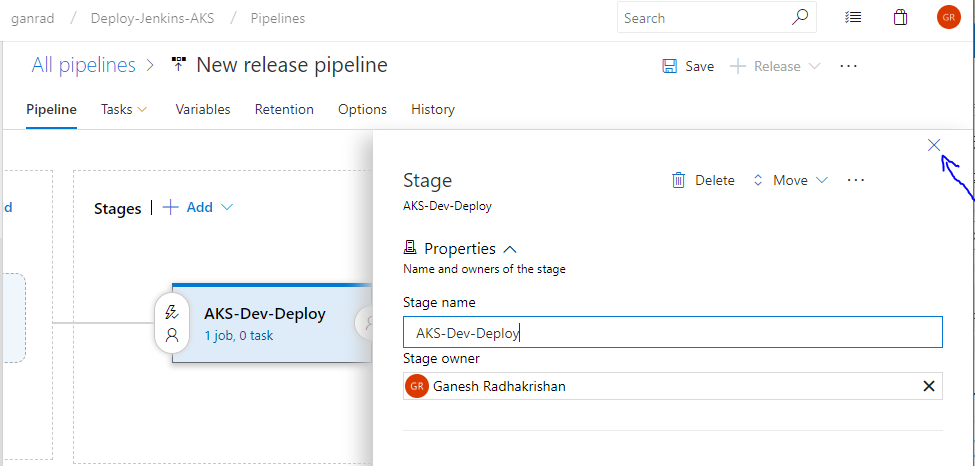
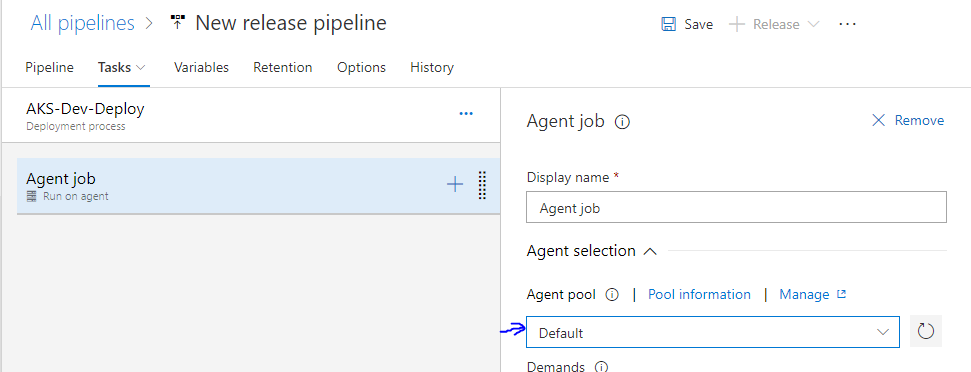

## Use Azure DevOps to deploy Jenkins CI/CD on AKS and implement a Jenkins *Continuous Delivery* pipeline

**Prerequisites:**
1.  Before working on the hands-on labs in this project, readers are required to complete all hands-on labs in the [parent project](https://github.com/ganrad/k8s-springboot-data-rest).  In case you have come to this project directly, go back and finish the lab exercises in the parent project.
2.  Readers are required to be familiar with basic Linux commands.  Experience working in Linux environments will definitely be helpful.
3.  Readers are assumed to have prior exposure to DevOps tools such as Azure DevOps (VSTS) and/or Jenkins CI/CD.

**Description:**
In a nutshell, you will work on the following tasks.
1. Implement a *Azure DevOps Build and Release Pipeline* to deploy Jenkins CI/CD on AKS (Section [A])

   **Result:** A Jenkins CI/CD cluster (1-executor) deployed on Azure Kubernetes Service (AKS)
2. Implement a *Continuous Delivery Pipeline* in Jenkins to build and re-deploy *po-service* Springboot Java microservice on AKS (Section [B])

   **Result:** A **Continuous Delivery** pipeline deployed in Jenkins which will be used to re-deploy the *po-service* microservice on AKS (previously deployed to AKS in the parent project).

**Workflow:**
For easy and quick reference, readers can refer to the following on-line resources as needed.
- [Azure DevOps](https://docs.microsoft.com/en-us/azure/devops/?view=vsts)
- [Jenkins](https://jenkins.io/doc/)

**Important Notes:**
- Keep in mind that this is an **Advanced** lab targeted towards experienced Kubernetes users who are familiar with CLI (`kubectl`) and the API model.

### A] Implement Azure DevOps pipelines to deploy Jenkins CI/CD on AKS
**Time to complete:**

### B] Implement a Continuous Delivery (CD) pipeline for *po-service* microservice in Jenkins
**Time to complete:**

1. Open a terminal window and connect to the Bastion host (Linux VM) via SSH.  Use the command below to ascertain the IP address of the **Jenkins** service.  The value under column *EXTERNAL-IP* is the host IP.
   ```
   gradhakr@garadha-surface:~/git-repos/k8s-springboot-data-rest/extensions/jenkins-ci-cd$ kubectl get svc -n jenkins
   NAME                              TYPE           CLUSTER-IP     EXTERNAL-IP     PORT(S)        AGE
   amber-nightingale-jenkins-chart   LoadBalancer   10.0.115.162   104.42.121.82   80:31573/TCP   11h
   ```
   Use to web browser to access the Jenkins UI.  
   **NOTE:** For the purposes of this lab, security in Jenkins has been disabled.

2. In this step, add a global variable *ACR_LOGINSERVER' which will be used in the CD pipeline.

   Click on **Manage Jenkins** on the left nav panel.  See image below.
  
   
  
   Then click on **Configure System**.  In the configuration web page, click on **Environment variables**.  Add an environment variable named **ACR_LOGINSERVER**.  Specify the variable value to be the name of your ACR which you deployed in the parent project.  It should be of the form **xxxx**.azurecr.io, where *xxxx* is the name of your registry.  Also, under *Build Timestamp*, change the value of *Pattern* to only include the day.  See screenshot below.

   

   Click **Save**.

3. Store the ACR SP credentials (created in parent project) in Jenkins Credential vault.

   This credential will be used to access ACR in the CD pipeline.

   Click on **Credentials** on the left nav panel.  See image below.  

   

   Click on **Jenkins** link under *Stored scoped to Jenkins* as shown in the image below.

   

   Click on **Global credentials (unrestricted)** link. Then click on **Add Credentials** link as shown in the image below.

   

   In the next web page, provide the details as shown in the image below.  For **Username**, specify the Azure Service Principal (SP) **appId** value and for **Password** specify the SP **password**.  For **ID**, specify the value `acr-credentials`.  These values are needed for pushing the built *po-service* container image into ACR.

   

   Click **OK**.

4. Store the AKS credentials (Kube Config) in Jenkins Credential vault.

   This credential will be used to deploy the *po-service* microservice on AKS in the CD pipeline.

   Click on **Add Credentials** link again.  Provide the values as shown in the image below.  In the dropdown box for **Kind**, select value `Secret file`.  Click on **Choose File** and select the *Kubernetes Config* file which you saved in the parent project labs.  Specify value `aks-credentials` for field **ID** and enter a short description for this credential in the **Description** field.

   

   Click **OK**.  Then click on the **Jenkins** link on the top nav panel as shown in the image below.

   

5. Next, define a CD Pipeline.

   Click on **New Item** in the left nav panel OR click on **create new jobs** link.

   

   Give the CD pipeline a meaningful name and select the **Pipeline** project as shown in the image below.

   

   Click **OK**.  On the configuration web page and in the **Description** field, provide a brief description for this pipeline.  In the **General** section, select the checkbox besides **GitHub Project** and specify the URL for the GitHub project which you forked in the parent project.  Make sure the URL is the URL for your forked GitHub repository.  See screenshot below.

   

   Under **Build Triggers**, click the checkbox besides **GitHub hook trigger for GITScm polling**.

   

   Under **Pipeline**, besides **Definition** select *Pipeline script from SCM*.  In the drop down box for **SCM**, select *Git* and specify this GitHub URL (Your forked repo.) for field **Repository URL**.  For field **Script Path**, specify value `extensions/jenkins-ci-cd/Jenkinsfile`.  Leave other field values as is.  Click **Save** when you are done.  See screenshot below.

   

5. In the next page, click **Build Now** in the left nav panel.

   

   The *Pipeline Stage View* plugin will display the progress of the pipeline execution.  See below.

   

   While waiting for the pipeline execution to finish, open `./Jenkinsfile` and go thru the *Pipeline* stages and steps.

   All the pipeline stages should complete OK (green box) as shown in the image below.

   
    
   To review the pipeline execution log and/or troubleshoot problems when any of the pipeline stages fail, click on the **Build #** under **Build History** and then click on **Console Output**.  Alternatively, you can also click on **Pipeline Steps** to review the details (log output) of each step executed during each stage.

   


   You have now successfully completed this lab.  Congrats!

   To recap, during this lab you completed the following steps -
   - Defined a **Build (CI)** and **Release (CD)** pipeline in *Azure DevOps* to build a custom Jenkins container image and then deployed Jenkins on *Azure Kubernetes Service*
   - Defined and executed a **Continuous Delivery** pipeline in Jenkins and re-deployed the *po-service* microservice on *Azure Kubernetes Service*.

