#  Use Azure Portal to create an instance of AKS and deploy Springboot Java Microservice Application

### A] Create an Azure Container Service (AKS) cluster and deploy our Springboot microservice
We will first deploy an AKS cluster on Azure using the Azure Portal.  We will then use the Kubernetes Web UI to deploy the **MySQL** database pod and **po-service** application pod.

YAML files for deploying all required Kubernetes objects (API resources) are provided in the **k8s-scripts** sub-directory.  Before proceeding with the next steps, feel free to inspect the Kubernetes object definition files.

Follow the steps below to provision the AKS cluster and deploy the *po-service* microservice.
1.  Switch back to the Linux VM (Bastion Host) terminal window where you have Azure CLI installed and make sure you are logged into to your Azure account.  We will install **kubectl** which is a command line tool for administering and managing a Kubernetes cluster.  Refer to the commands below in order to install *kubectl*.
```
# Switch to your home directory
$ cd
#
# Create a new directory 'aztools' under home directory to store the kubectl binary
$ mkdir aztools
#
# Install kubectl binary in the new directory
$ az aks install-cli --install-location=./aztools/kubectl
#
# Add the location of 'kubectl' binary to your search path and export it.
# Alternatively, add the export command below to your '.bashrc' file in your home directory. Then logout of your VM (Bastion Host) from the terminal window and log back in for changes to take effect.  By including this command in your '.bashrc' file, you don't have to set the location of the 'kubectl' binary in the PATH environment variable and export it every time you logout and log in to this VM.
$ export PATH=$PATH:/home/labuser/aztools
#
# Check if kubectl is installed OK
$ kubectl version -o yaml
```

2.  Login to the (Azure portal)[https://portal.azure.com] using your account ID and password.  Verify that you have adequate permissions to register applications.  See screenshot below.


3.  Search for **Container services (managed)** PaaS service in **All services**. Click on the link to open up the blade (detail panel).  Then click on *Create container service (managed)* button.  Provide details for AKS cluster as shown in the screen shots below.  In the summary screen, review all the details and then click on **Ok**.  

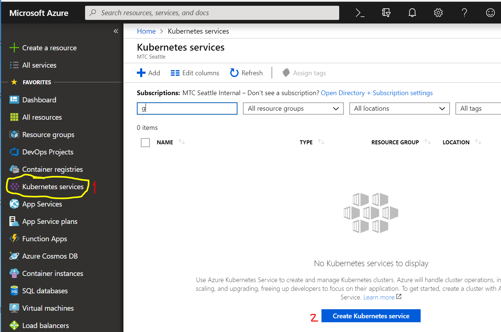

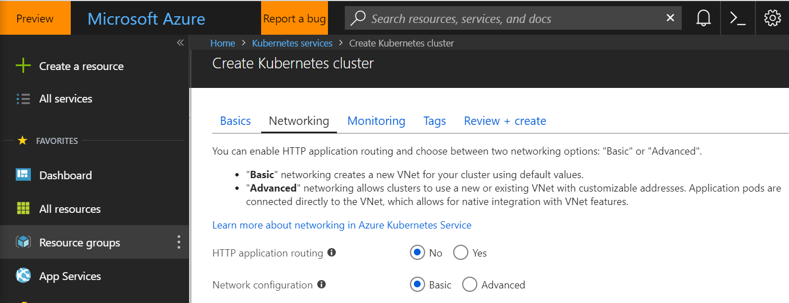
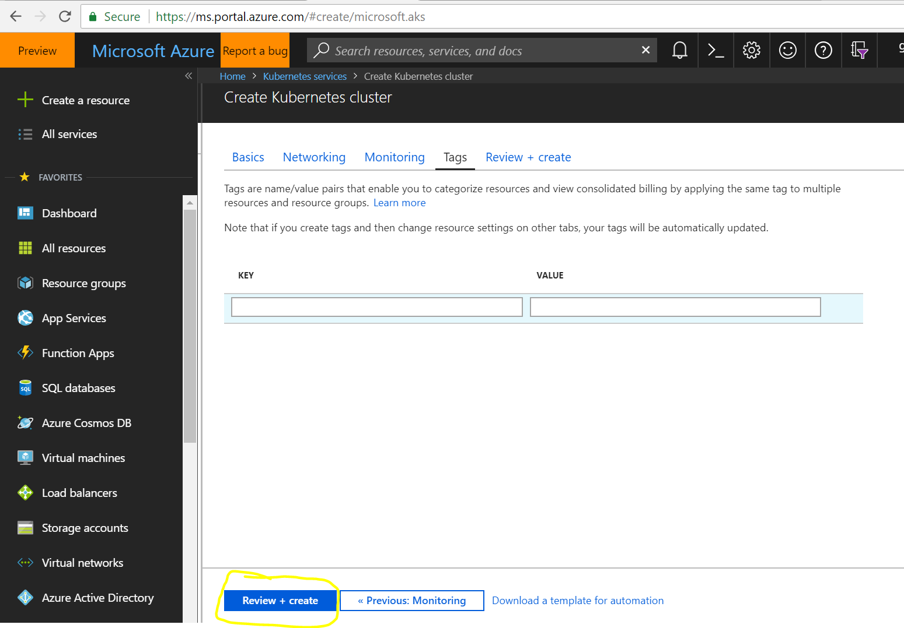

The AKS cluster will take a few minutes (5-10 mins) to get provisioned.  Once the cluster creation process finishes, the **akscluster** cluster will be shown in the list as shown in the screenshot below.


4.  On the Bastion host, login into your Azure account. Then start the Kubernetes Dashboard proxy using **one** of the options below -
- Start the Kubernetes dashboard proxy using kubectl
```
# Configure kubectl to connect to the AKS cluster
$ az aks get-credentials --resource-group myResourceGroup --name akscluster
#
# Start the Kubernetes dashboard proxy
$ kubectl proxy -p 8001
```
- Start the Kubernetes dashboard proxy using Azure AKS command
```
# Configure kubectl to connect to the AKS cluster
$ az aks get-credentials --resource-group myResourceGroup --name akscluster
#
# Open the Kubernetes dashboard by running the following command
$ az aks browse --name akscluster --resource-group myResourceGroup
```

5.  Open a browser tab and point your browser to the Kubernetes dashboard [http://localhost:8001/api/v1/namespaces/kube-system/services/http:kubernetes-dashboard:/proxy/](http://localhost:8001/api/v1/namespaces/kube-system/services/http:kubernetes-dashboard:/proxy/)

6.  Next, create a new Kubernetes **namespace** resource.  This namespace will be called *development*.  In the Kubernetes **Dashboard UI**, click on *Namespaces* under *Cluster* on the left.  Then click on *Create* link on the top.  This will open up a YAML/JSON editor (shown below).  Cut and paste the contents of file **dev-namespace.json** into the editor, then click *Create*.  See the screenshots below.

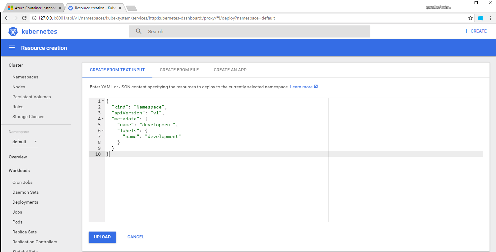


7.  Open another terminal window and connect to the Bastion host.  Create the **dev** Kubernetes context and make it the current context.  We will be deploying the **MySQL** and **po-service** application pods and all associated Kubernetes resources (objects) within this namespace.
```
# Create the 'dev' context
$ kubectl config set-context dev --cluster=akscluster --user=clusterUser_myResourceGroup_akscluster --namespace=development
#
# Switch the current context to 'dev'
$ kubectl config use-context dev
#
# Check your current context (should list 'dev' in the output)
$ kubectl config current-context
```

8.  Configure Kubernetes to use the ACR (configured in step [B]) to pull our application container images and deploy containers.  When creating deployments, replica sets or pods, AKS (Kubernetes) will try to use docker images already stored locally (on nodes) or pull them from the public docker hub.  To change this, we need to specify the ACR as part of Kubernetes object configuration (yaml or json).  Instead of specifying this directly in the configuration, we will use Kubernetes **Secrets**.  By using secrets, we tell the Kubernetes runtime to use the info. contained in the secret to authenticate against ACR and push/pull images.  In the Kubernetes object (pod definition), we reference the secret by it's name only.

kubectl parameter | Value to substitute
----------------- | -------------------
SERVICE_PRINCIPAL_ID | 'appId' value from step [B]
YOUR_PASSWORD | 'password' value from step [B]

```
# Create a secret containing credentials to authenticate against ACR.  Substitute values for REGISTRY_NAME, YOUR_MAIL, SERVICE_PRINCIPAL ID and YOUR_PASSWORD.
$ kubectl create secret docker-registry acr-registry --docker-server <REGISTRY_NAME>.azurecr.io --docker-email <YOUR_MAIL> --docker-username=<SERVICE_PRINCIPAL_ID> --docker-password <YOUR_PASSWORD>
#
# List the secrets
$ kubectl get secrets
```

10.  Use the Kubernetes dashboard (Web) UI to deploy the **MySQL* database resources on Kubernetes.
-  Create the MySQL Secret API object.  Click on *Secrets* link on the left navigational panel and then click on *Create* link on the top.  Cut and paste the contents of file *k8s-scripts/mysql-secret.yaml* into the editor and click *Upload*.  Alternatively, you can also use the *Create From File* option to upload the contents of this file and create the Secret API object.

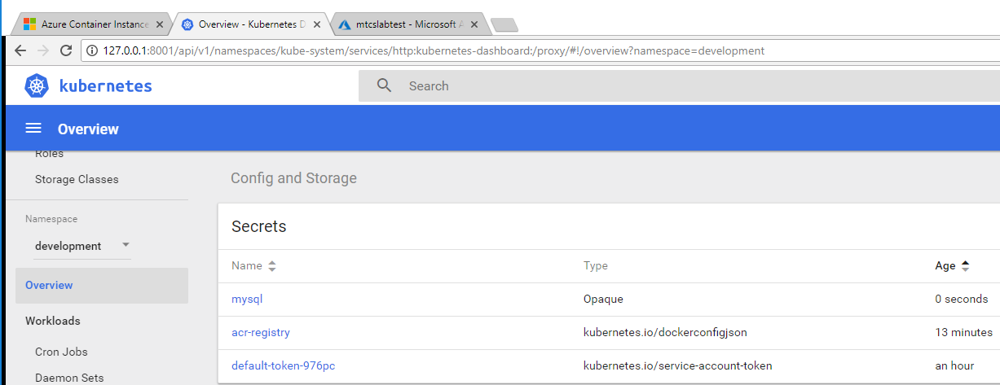

-  Create the MySQL Service API object.  Click on the *Services* link on the left navigational panel and then click on *Create* link on the top.  Cut and paste the contents of file *k8s-scripts/mysql-svc.yaml* into the editor and then click *Upload*.  Alternatively, use the *Create From File" option to upload the contents of this file and create the Service API object.

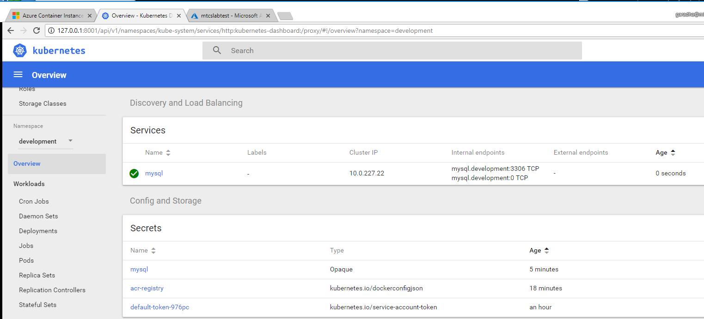

-  Create the MySQL Replication Controller API object.  Click on the *Replication Controllers* link on the left navigational panel and then click on *Create* link on the top.  Cut and paste the contents of file *k8s-scripts/mysql-rc.yaml* into the editor and then click *Upload*.  Alternatively, use the *Create From File" option to upload the contents of this file and create the Replication Controller API object.
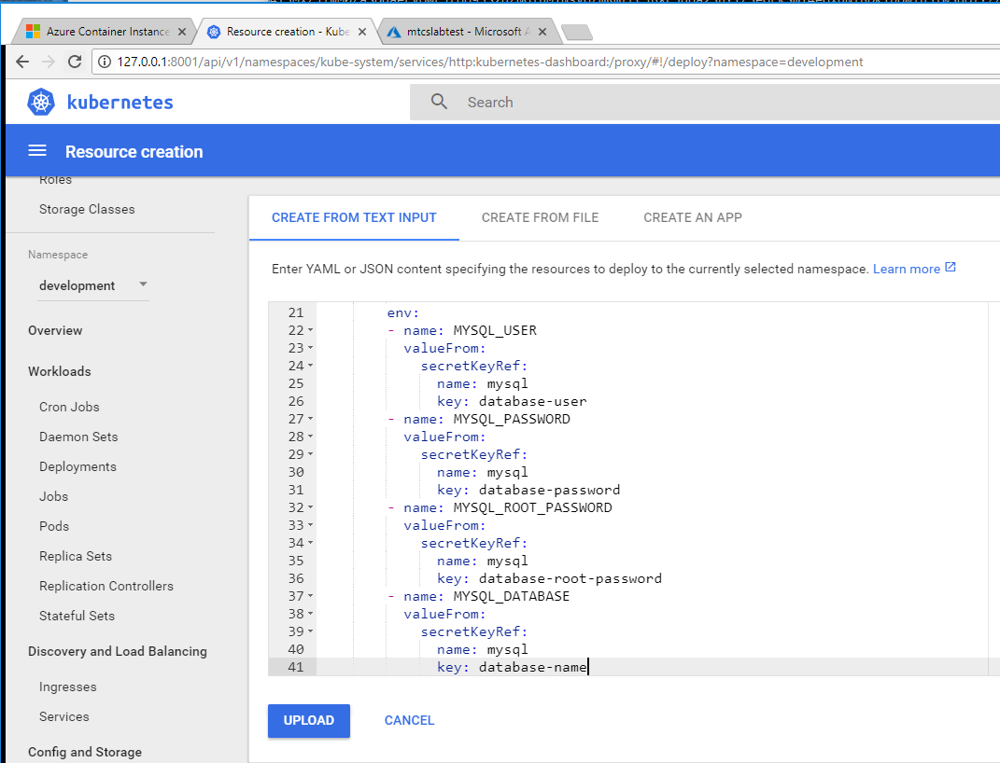
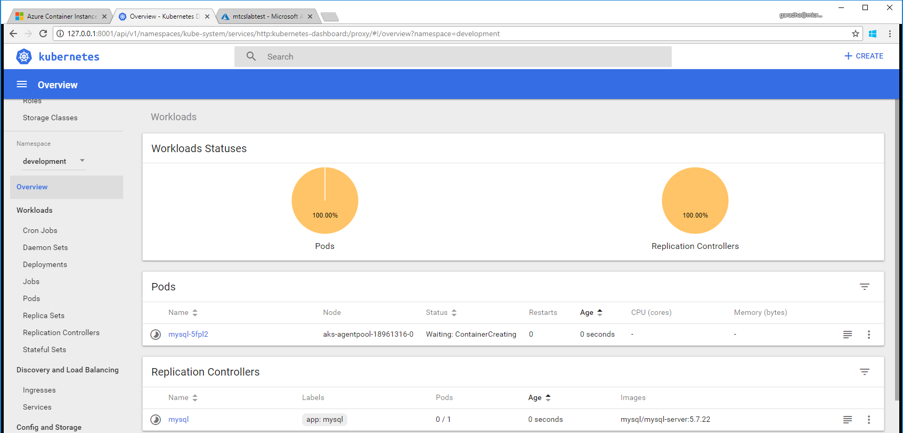


8.  Use the Kubernetes dashboard (Web) UI to deploy the **po-service* Springboot application resources on Kubernetes.
-  Create the Config Map API object.  Click on *Config Maps* link on the left navigational panel and then click on *Create* link on the top.  Cut and paste the contents of file *k8s-scripts/app-config-map.yaml* into the editor and click *Upload*.  Alternatively, you can also use the *Create From File* option to upload the contents of this file and create the Configmap API object.


-  Create the Secret API object.  Click on the *Secrets* link on the left navigational panel and then click on *Create* link on the top.  Cut and paste the contents of file *k8s-scripts/app-mysql-secret.yaml* into the editor and then click *Upload*.  Alternatively, use the *Create From File" option to upload the contents of this file and create the Secret API object.
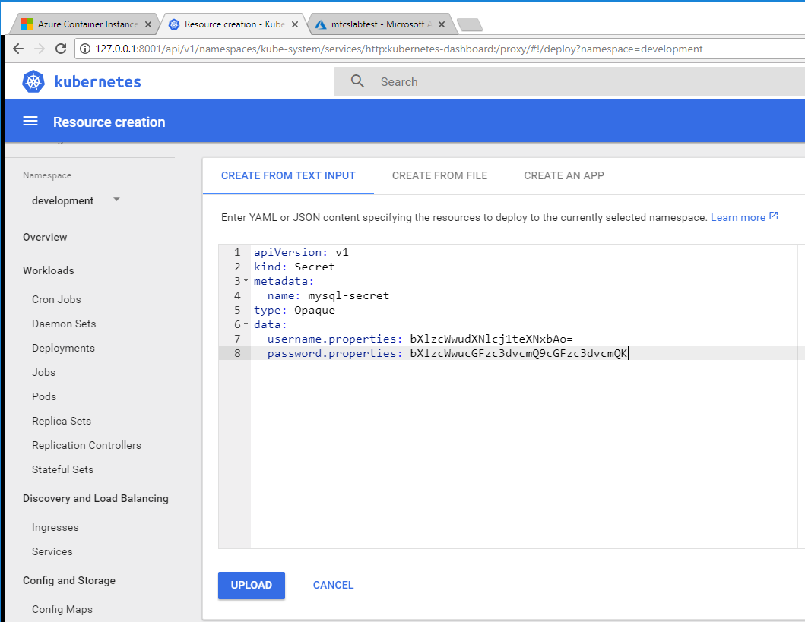


-  Create the Service API object.  Click on the *Services* link on the left navigational panel and then click on *Create* link on the top.  Cut and paste the contents of file *k8s-scripts/app-service.yaml* into the editor and then click *Upload*.  Alternatively, use the *Create From File" option to upload the contents of this file and create the Service API object.


-  Create the Replication Controller API object.  Click on the *Replication Controllers* link on the left navigational panel and then click on *Create* link on the top.  Cut and paste the contents of file *k8s-scripts/app-rc.yaml* into the editor and then click *Upload*.  Alternatively, use the *Create From File" option to upload the contents of this file and create the replication controller API object.
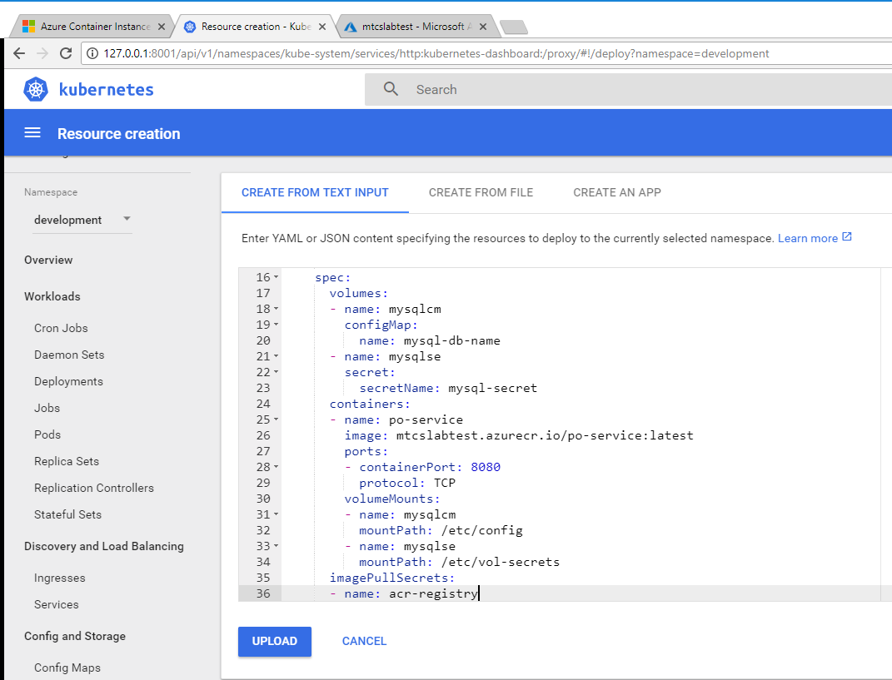

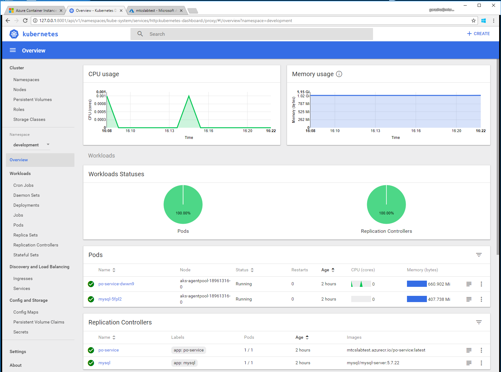

8.  You can now go back to the [k8s-springboot-data-rest](https://github.com/ganrad/k8s-springboot-data-rest) GitHub project web page and follow the instructions for testing the **po-service** microservice application.
